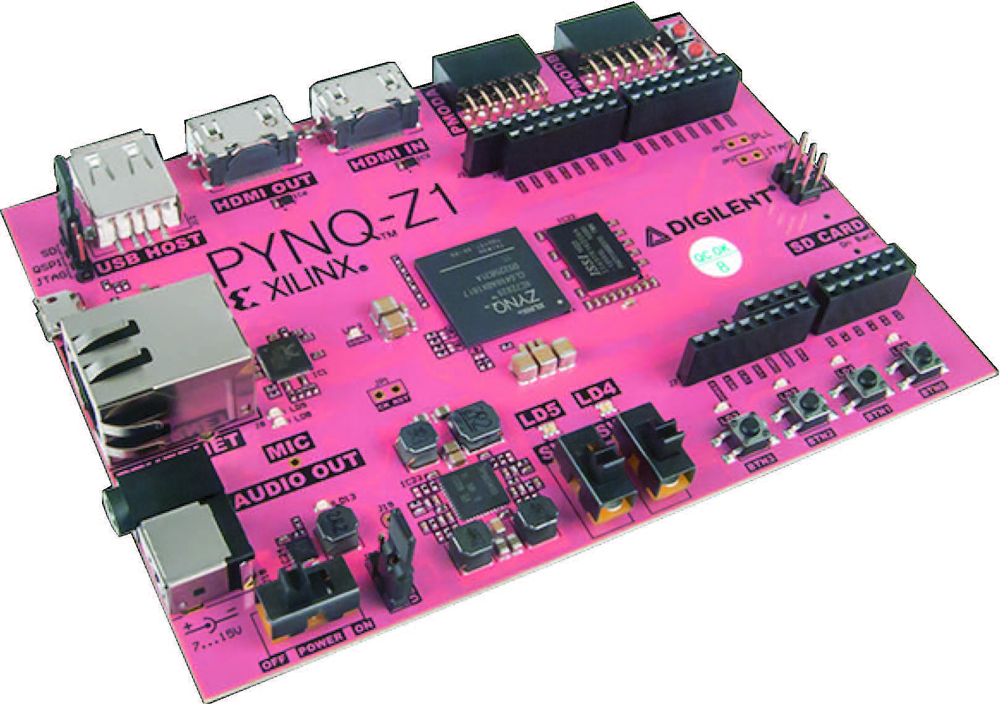

# PYNQ
Programa para detección de marcas en las extremidades superiores y envió de ángulos en los brazos para control de un agente robótico. Este fue implementado en la tarjeta electrónica PYQN-Z1, en la cual corre un servidor que contiene JUPYTER Notebooks.

